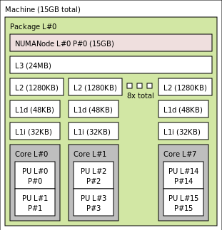

# Cache and Memory Performance Profiling

The code written and used for this project can be found [here](https://github.com/vereimyst/ACS-Project-1).

## Process

Firstly, to obtain any of the measurements required I need to know the specs of the system I am working with. This information can be obtained via a variety of methods. Given the fact that I am working with Linux on WSL2, ChatGPT recommends the following (disregarding the duplicate methods):

1. `lscpu | grep -i cache`
2. `sudo dmidecode -t cache`
3. `sudo apt-get install hwloc && lstopo`
4. `getconf -a | grep CACHE`

```
$ lscpu | grep -i cache
L1d cache:      384 KiB (8 instances)       -> 48 KiB per instance
L1i cache:      256 KiB (8 instances)
L2 cache:       10 MiB (8 instances)        -> 1.25 MiB per instance
L3 cache:       24 MiB (1 instance)
```

This first method gives a generic overview of what cache structures exist in my laptop, an Alienware m15 R6. Notably, the numbers are rounded and have relatively low precision as a result. Additionally, we can (essentially) disregard the L1i cache capacity for the purposes of this project, as it is reserved for instructions. The second method unfortunately didn't work due to no SMBIOS nor DMI entry point being found. The third method gives a visual representation of the hierarchical structure that exists internally.



Again, the capacity values have low precision, though the visualization is quite helpful, allowing us to better understand how each block is connected. The last method gives the highest level of precision as well as some needed details about cache line size and associativity.

```
$ getconf -a | grep CACHE
LEVEL1_ICACHE_SIZE                 32768
LEVEL1_ICACHE_ASSOC
LEVEL1_ICACHE_LINESIZE             64
LEVEL1_DCACHE_SIZE                 49152
LEVEL1_DCACHE_ASSOC                12
LEVEL1_DCACHE_LINESIZE             64
LEVEL2_CACHE_SIZE                  1310720
LEVEL2_CACHE_ASSOC                 20
LEVEL2_CACHE_LINESIZE              64
LEVEL3_CACHE_SIZE                  25165824
LEVEL3_CACHE_ASSOC                 12
LEVEL3_CACHE_LINESIZE              64
LEVEL4_CACHE_SIZE                  0
LEVEL4_CACHE_ASSOC
LEVEL4_CACHE_LINESIZE
```

Holding some concern over whether WSL2 might be misrepresenting these values, I went into Task Manager and checked the Performance tab, shown below. Thankfully all the values line up, so we can move onto actually testing my system.


## Part 1

We want to measure the read/write latency of the caches (L1-3) and the main memory when the queue length is zero. To do this, I set the data values such that they occupy the entire available cache/memory. Additionally, to avoid confounding the latency causes, we need to minimize the operation latency by performing simple operations (e.g. R/W). To avoid prefetching, I added a randomizer selecting indices and array values. The caveats being that WSL2 may have internal processor latency due to being a Virtual OS and functions timing performance inherently have overhead. Some variation existed in the results, but one set of output averages is displayed below. The general trends of increasing latency as we ascend memory tiers and read latencies being lower than write latencies is clear. Removing the pseudorandomization of the write values causes the write latency to be faster due to write buffer asynchronization/optimization.

```
Avg Read Latency for L1d Cache: 1.862 ns
Avg Write Latency for L1d Cache: 2.703 ns
Avg Read Latency for L2 Cache: 5.416 ns
Avg Write Latency for L2 Cache: 5.512 ns
Avg Read Latency for L3 Cache: 9.677 ns
Avg Write Latency for L3 Cache: 14.513 ns
Avg Read Latency for Main Memory: 11.412 ns
Avg Write Latency for Main Memory: 14.650 ns
```

## Part 2

We wish to evaluate the maximum bandwidth of the main memory under different data access granularity (i.e., 64B, 256B, 1024B) and different read vs. write intensity ratio (i.e., read-only, write-only, 70:30 ratio, 50:50 ratio). According to the task manager, as shown below, the memory clock speed is 3200 MT/s (megatransfers per second) or MHz for my laptop.


My laptop has 2 DDR4 SoDIMM, so ChatGPT calculated a bandwidth of 51.2 GB/s. However, according to the specs documentation on Dell's device support website, the other DDR4 has a memory speed of 3466 MHz, meaning the bandwidth it has should be slightly higher the resulting value.


The key point to be wary of here is ensuring the data is larger than the available caches since we are evaluating main memory. I also flushed the cache line to be safe. The following figures display one set of experimental values I obtained. The second is a up-scaled verion of the first (without the 5096B access) to better see the behavior as read ratio decreases.


As expected, the maximum bandwidth reached is roughly 60GB/s, which is higher than the bandwidth calculated for 2 DDR4-3200s. What isn't expected is that regardless of the scale looked at, the largest chunk results in the highest memory bandwidth. This seems somewhat counterintuitive, but the larger data chunks allow for more optimal memory system use by reducing overhead.


## Part 3

Next, we'd like a demonstration of what the queuing theory predicts in the tradeoff between read/write latency and throughput of the main memory. Queuing theory is the mathematics of lines, for which there are a couple main components. We have read/write requests as the entities and main memory as the "service facility" for this scenario. Using `lscpu`, I know that my laptop can have as many as 16 threads at once (8 cores per socket, 2 threads per core). An iteration of experimental results gave me the following data.


All graphs show a general trend of increasing latency as the number of threads in use increased, which perfectly demonstrates queuing theory. The only outlier value is for the 4-thread combined latency, which spiked up drastically. However, it is clear that, regardless of the irregular behavior, the throughput decreases where latency increases and vice versa.

# Part 4

Now, we want to examine the impact of cache miss ratio on the software speed performance. To prevent the impact of the software timing from affecting the measurements, we will utilize lighter compuations like multiplication. Additionally, we need to ensure we are encountering a cache miss. Unfortunately, I found that perf does not allow for outputting much of the information we were looking for on my system despite running with sudo. I've yet to find the cause of this issue.

```
Testing L1d Cache:
L1d Cache: Size = 49152 bytes, Average Latency = 0.000023047 seconds, CPU Cycles = 53053

Testing L2 Cache:
L2 Cache: Size = 1310720 bytes, Average Latency = 0.000630432 seconds, CPU Cycles = 1452511

Testing L3 Cache:
L3 Cache: Size = 25165824 bytes, Average Latency = 0.012692820 seconds, CPU Cycles = 29244253

Testing Main Memory:
Main Memory: Size = 50331648 bytes, Average Latency = 0.025444119 seconds, CPU Cycles = 58623244
```

To note, as seen above, the base speed of my CPU is 2.30GHz, hence the short timing despite the large CPU Cycle counts. The cycles stalled will vary depending on the clock cycles. What can be applied in other scenarios is that the higher the memory block is on the hierarchy, the longer the recovery period is as is sensible. We see for each of the cache levels, there is a whole order (power of 10) difference in the latencies.


# Part 5

Lastly, we want to illustrate the impact of TLB table miss ratio on the software speed performance. This should be under similar circumstances as the previous part in terms of software operations. First I gained a better understanding of the TLB size, which is not very well documented in many places.

```
$ cpuid | grep -i TLB
L1 TLB/cache information: 2M/4M pages & L1 TLB (0x80000005/eax): 
L1 TLB/cache information: 4K pages & L1 TLB (0x80000005/ebx):
L2 TLB/cache information: 2M/4M pages & L2 TLB (0x80000006/eax):
L2 TLB/cache information: 4K pages & L2 TLB (0x80000006/ebx):
```

I started with a numerical calculation of the average TLB table miss latency, which gave me the following:

```
Testing with 4KB Pages:
4KB Pages: Total Size = 50331648 bytes, Pages = 12288, Average Latency = 0.027048449 seconds, CPU Cycles = 62319618

Testing with 2MB Pages:
2MB Pages: Total Size = 50331648 bytes, Pages = 24, Average Latency = 0.027436446 seconds, CPU Cycles = 63213565
```

This was over a sample size of 1000 iterations and the average latency is already on par with or greater than the latency of accessing the main memory. The latter value makes sense that it is more costly Given how costly TLB misses are and how frequently they occur, I think it is more than sufficient in demonstrating the effects of the misses. For funsies though, we can observe there is a linear relationship between the number of TLB misses and the latency.


## Citations

ChatGPT used liberally for all parts.